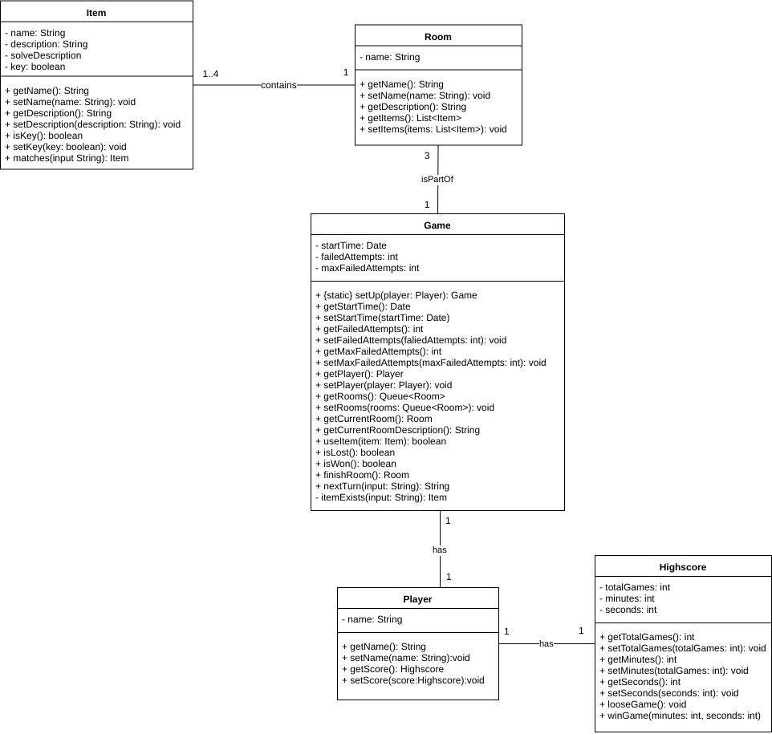
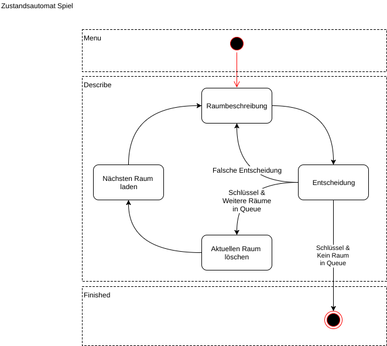

## Status
 

    

# Systemidee unseres Skills
Alexa's Escape ist ein interaktives Adventure-Spiel, in dem es darum geht, dem fiktiven Charakter Alexa über das Telefon zu helfen aus einem Haus zu entkommen. Das Spiel startet mit dem "Telefonanruf" von Alexa an den Spieler. Alexa wurde gefangen genommen und befindet sich in einem fremdem Haus, aus dem sie durch verschiedene Räume hindurch zum Ausgang gelangen muss. Die Entführer sind nicht da, könnten aber theoretisch jeden Moment kommen. In jedem Zimmer gibt es Gegenstände, die Alexa dabei helfen den jeweiligen Raum und schlussendlich auch das Haus zu verlassen. Über die Auswahl der Gegenstände wird nun der Spieler am Telefon entscheiden und leitet Alexa somit aus dem Haus. Alexa kann immer nur eine begrenzte Anzahl an Gegenständen mitnehmen. Nach einer gewissen Anzahl an Fehlversuchen kommen jedoch die Entführer zurück und das Spiel ist vorbei. Sobald Alexa vor dem Eintreffen der Entführer das Haus verlassen kann, ist die Flucht geglückt und die erspielte Zeit wird gespeichert. Falls die Entführer vorher zurückkommen, ist der Versuch gescheitert und Alexa wird wieder eingesperrt. Ein Vergleich der Zeiten mit vorherigen Versuchen und anderen Spielern ist möglich.

## Anwendungsfalldiagramm

## Klassendiagramm

## Zustandsautomat

[Beispiel User Story](https://github.com/sweIhm-ws2018-19/skillproject-fr-15/issues/46)

## Erkenntnisse aus dem Praktikum Software Engineering 1

- Teamarbeit(Kommunikation, Aufgabenverteilung, usw.)
- Toolchain

## Ausblick auf mögliche Erweiterungen

